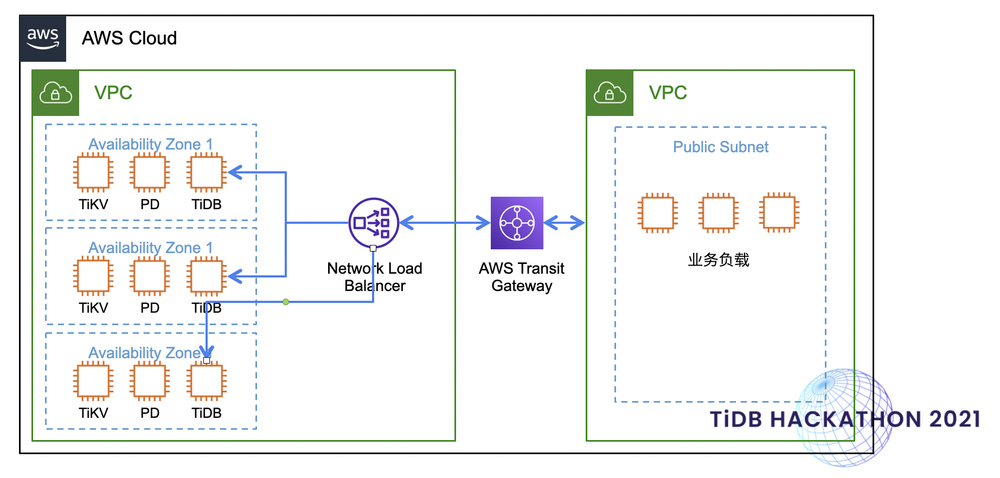

[](https://github.com/pingcap/tiup/blob/master/LICENSE)
[](https://golang.org/)
[](https://goreportcard.com/badge/github.com/pingcap/tiup)
[](https://codecov.io/gh/pingcap/tiup/)
[](https://app.fossa.com/projects/git%2Bgithub.com%2Fpingcap%2Ftiup?ref=badge_shield)

# Oh My TiUP

## 项目介绍

Oh My TiUP 的命名灵感来自于 [Oh My Zsh](https://ohmyz.sh/) 项目，希望能像 Oh My Zsh 一样成为一个趁手的生产力工具。Oh My TiUP 将基于 TiUP，围绕着易用性打造一系列甜品级的特性。

## 背景&动机
TiUP 作为 TiDB 系列所有产品线的入口，是非常重要的生态工具，可谓是 TiDB 的门神。目前 TiUP 作为部署工具已经收到了广泛地认可，但仍然在一些场景存在力不从心的情况。我们将以提高易用性，降低用户门槛为宗旨，为 TiUP 支持一系列甜品级的特性。

## 项目设计

### TiUP Cluster on Cloud

#### 背景
TiUP Cluster 用于在生产上部署 TiDB 集群，提供了非常丰富的功能以适用于生产上复杂的部署环境。但 TiUP Cluster 主要是为 on-premise 场景部署而设计的，并未考虑云上场景。虽然在云上场景中，tidb operator 已经能提供丰富的集群部署和管理能力，但 tidb operator 依赖 K8s，在追求轻量和易运维的场景中并不适用。目前在云上但不使用 K8s 的场景中，TiDB 集群的部署和管理仍然是一块空白。

#### 产品设计
我们设计了一个新的名为 cloud-cluster 的 TiUP 组件，专门用于 TiDB 集群的云上部署和管理。
  - [部署集群](https://github.com/luyomo/tisample#%E9%83%A8%E7%BD%B2%E9%9B%86%E7%BE%A4)
  - [扩容](https://github.com/luyomo/tisample#%E6%89%A9%E5%AE%B9%E9%9B%86%E7%BE%A4)
  - [缩容](https://github.com/luyomo/tisample#%E7%BC%A9%E5%AE%B9%E9%9B%86%E7%BE%A4)
  - [销毁集群](https://github.com/luyomo/tisample#%E9%94%80%E6%AF%81%E9%9B%86%E7%BE%A4)

#### 设计架构


##### 部署集群
在部署集群时，cloud-cluster 不需要用户指定要部署的目标主机 IP，而是用户指定要部署的目标主机机型，Region、AZ 等信息，cloud-cluster 可以自动向 AWS 申请虚机并部署 TiDB 集群。

###### 能力
- deploy 集群时可以自动根据用户的配置向 AWS 申请 EC2（包含 VPC，EBS 配置）
- EC2 创建并启动完毕后，tiup 可以自动将 TiDB 产品线族部署到目标 EC2
- 根据 ec2 的 region 和 az，自动设置实例的物理位置 label
- tiup 可以自动创建 ELB，作为 TiDB 上层的负载均衡器

###### User Interface

官方 deploy 组件部署集群的命令如下：
tiup cluster deploy tidb-test v5.3.0 ./topology.yaml --user root [-p] [-i /home/root/.ssh/gcp_rsa]

cloud-deploy 组件部署集群命令如下：
tiup cloud-cluster deploy tidb-test v5.3.0 ./topology.yaml #TODO：加一些用于 AWS 授权的参数

相比与官方 deploy 指令，cloud-cluster 的 deploy 指令去除了 -p -i 这种用于 ssh 授权的指令，而添加一些用于 AWS 授权的指令

配置文件：

```
aws_topo_configs:
  general:
    imageid: ami-0ac97798ccf296e02            # Image ID for TiDB cluster's EC2 node
    keyname: jay.pingcap                      # key name to login from workstation to EC2 nodes
    cidr: 172.83.0.0/16                       # VPC cidr
    instance_type: m5.2xlarge                 # default instance type for EC2 nodes
    tidb_version: v5.2.0                      # TiDB version to deploy
  pd:
    instance_type: m5.2xlarge                 # PD instance type
    count: 3                                  # Number of PD nodes to generate
  tidb:
    instance_type: m5.2xlarge                 # TiDB instance type
    count: 2                                  # Number of TiDB nodes to generate
  tikv:
    instance_type: m5.2xlarge                 # TiKV instance type
    count: 3                                  # Number of TiKV nodes to generate
    volumeSize: 80                            # Volume Size of the TiKV nodes
  dm:
    instance_type: t2.micro                   # DM instance type
    count: 1                                  # Number of DM node to generate
  ticdc:
    instance_type: m5.2xlarge                 # TiCDC instance type
    count: 1                                  # Number of TiCDC nodes to generate
```

Generate aws resources and deploy tidb cluster
```
pi@c1s11:~/workspace/tisample $ ./bin/aws tidb2ms deploy hackathon ~/workspace/hackathon/aws-tidb-simple.yaml
Please confirm your topology:
AWS Region:      Tokyo
Cluster type:    tidb
Cluster name:    hackathon
Cluster version: v5.1.0
User Name:       admin
Key Name:        jay

Component    # of nodes  Instance Type  Image Name             CIDR           User
---------    ----------  -------------  ----------             ----           ----
Workstation  1           m5.2xlarge     ami-0ac97798ccf296e02  172.82.0.0/16  admin
TiDB         2           m5.2xlarge     ami-0ac97798ccf296e02  172.83.0.0/16  master
PD           3           m5.2xlarge     ami-0ac97798ccf296e02  172.83.0.0/16  master
TiKV         3           m5.2xlarge     ami-0ac97798ccf296e02  172.83.0.0/16  master
TiCDC        1           m5.2xlarge     ami-0ac97798ccf296e02  172.83.0.0/16  master
DM           1           t2.micro       ami-0ac97798ccf296e02  172.83.0.0/16  master
Attention:
    1. If the topology is not what you expected, check your yaml file.
        2. Please confirm there is no port/directory conflicts in same host.
        Do you want to continue? [y/N]: (default=N) y
+ Deploying all the sub components for tidb2ms solution service
  - Preparing workstation ... ⠙ Echo: Creating VPC
+ Deploying all the sub components for tidb2ms solution service
+ Deploying all the sub components for tidb2ms solution service
  - Preparing workstation ... ⠇ Echo: Creating VPC
tidb : Creating Security Group ... ...  ... ⠼ Echo: Creating security group
+ Deploying all the sub components for tidb2ms solution service
+ Deploying all the sub components for tidb2ms solution service
  - Preparing workstation ... Done
  - Preparing tidb servers ... Done
+ Deploying tidb2ms solution service ... ...
  - Prepare DMS servicer and additional network resources :22 ... ⠏ Echo: Deploying TiCDC
The error here is <&errors.errorString{s:"No RDB Instance found(No matched name)"}>
+ Deploying tidb2ms solution service ... ...
  - Prepare DMS servicer and additional network resources :22 ... Done
Verbose debug logs has been written to /home/pi/.tiup/logs/aws-nodes-debug-2022-01-08-09-05-27.log.
```

AWS resources
```
pi@c1s11:~/workspace/tisample $ ./bin/aws tidb2ms list hackathon
+ Listing aws resources
  - Listing VPC ... Done
  - Listing Subnets ... Done
  - Listing Route Tables ... Done
  - Listing Security Groups ... Done
  - Listing Transit gateway  ... Done
  - Listing Transit gateway vpc attachment ... Done
  - Listing EC2 ... Done
  - Listing Load Balancer  ... Done
Cluster  Type:      tisample-tidb2ms
Cluster Name :      hackathon

Resource Type:      VPC
Component Name  VPC ID                 CIDR           Status
--------------  ------                 ----           ------
tidb            vpc-094a70a2eda96a0d9  172.83.0.0/16  available
workstation     vpc-0ebe1f7a15535f32e  172.82.0.0/16  available

Resource Type:      Subnet
Component Name  Zone             Subnet ID                 CIDR            State      VPC ID
--------------  ----             ---------                 ----            -----      ------
tidb            ap-northeast-1a  subnet-05303c850d3e395bb  172.83.1.0/24   available  vpc-094a70a2eda96a0d9
tidb            ap-northeast-1c  subnet-0b187ad5016ce5c2c  172.83.2.0/24   available  vpc-094a70a2eda96a0d9
tidb            ap-northeast-1d  subnet-0e2116872a10b9188  172.83.3.0/24   available  vpc-094a70a2eda96a0d9
workstation     ap-northeast-1a  subnet-0dc7f2b4054aba960  172.82.11.0/24  available  vpc-0ebe1f7a15535f32e

Resource Type:      Route Table
Component Name  Route Table ID         DestinationCidrBlock  TransitGatewayId       GatewayId              State   Origin
--------------  --------------         --------------------  ----------------       ---------              -----   ------
tidb            rtb-0df8cd282cfe3a6b5  172.82.0.0/16         tgw-0a93c20132e7c22c9                         active  CreateRoute
tidb            rtb-0df8cd282cfe3a6b5  172.83.0.0/16                                local                  active  CreateRouteTable
workstation     rtb-09277e69270c614e7  172.82.0.0/16                                local                  active  CreateRouteTable
workstation     rtb-09277e69270c614e7  172.83.0.0/16         tgw-0a93c20132e7c22c9                         active  CreateRoute
workstation     rtb-09277e69270c614e7  0.0.0.0/0                                    igw-0329ce2e0baad348e  active  CreateRoute

Resource Type:      Security Group
Component Name  Ip Protocol  Source Ip Range  From Port  To Port
--------------  -----------  ---------------  ---------  -------
workstation     tcp          172.82.0.0/16    0          65535
workstation     tcp          0.0.0.0/0        22         22
workstation     icmp         172.82.0.0/16    -1         -1
tidb            tcp          0.0.0.0/0        8300       8300
tidb            tcp          0.0.0.0/0        1433       1433
tidb            tcp          0.0.0.0/0        20180      20180
tidb            tcp          172.83.0.0/16    0          65535
tidb            tcp          0.0.0.0/0        22         22
tidb            tcp          0.0.0.0/0        4000       4000
tidb            tcp          0.0.0.0/0        2379       2379
tidb            tcp          0.0.0.0/0        20160      20160
tidb            tcp          0.0.0.0/0        3306       3306
tidb            tcp          0.0.0.0/0        2380       2380
tidb            icmp         172.83.0.0/16    -1         -1
tidb            tcp          0.0.0.0/0        10080      10080

Resource Type:      Transit Gateway
Resource ID  :      tgw-0a93c20132e7c22c9    State: available
Component Name  VPC ID                 State
--------------  ------                 -----
tidb            vpc-094a70a2eda96a0d9  available
workstation     vpc-0ebe1f7a15535f32e  available

Load Balancer:      hackathon-cf7959a3b0c7415c.elb.ap-northeast-1.amazonaws.com
Resource Type:      EC2
Component Name  Component Cluster  State    Instance ID          Instance Type  Preivate IP   Public IP      Image ID
--------------  -----------------  -----    -----------          -------------  -----------   ---------      --------
dm              tidb               running  i-07d62c419ca2b3fe3  t2.micro       172.83.1.66                  ami-0ac97798ccf296e02
pd              tidb               running  i-0c2d80f6333f6a77b  m5.2xlarge     172.83.2.21                  ami-0ac97798ccf296e02
pd              tidb               running  i-05a19af4d8bfdfb7a  m5.2xlarge     172.83.1.117                 ami-0ac97798ccf296e02
pd              tidb               running  i-040ce4539e62fa6a5  m5.2xlarge     172.83.3.9                   ami-0ac97798ccf296e02
ticdc           tidb               running  i-0bb01a195b1f3cb32  m5.2xlarge     172.83.1.149                 ami-0ac97798ccf296e02
tidb            tidb               running  i-06fa2ff5edf5cee70  m5.2xlarge     172.83.1.97                  ami-0ac97798ccf296e02
tidb            tidb               running  i-02e57d8abdcc8c66f  m5.2xlarge     172.83.2.197                 ami-0ac97798ccf296e02
tikv            tidb               running  i-0e24e56798270fda6  m5.2xlarge     172.83.2.59                  ami-0ac97798ccf296e02
tikv            tidb               running  i-0f501a53bd0a8451c  m5.2xlarge     172.83.3.247                 ami-0ac97798ccf296e02
tikv            tidb               running  i-0ebb8edf4cfae6c08  m5.2xlarge     172.83.1.109                 ami-0ac97798ccf296e02
workstation     workstation        running  i-0a0e4c9b7167c6fa8  m5.2xlarge     172.82.11.69  54.65.110.179  ami-0ac97798ccf296e02
```

TiDB cluster status
```
pi@c1s11:~/workspace/tisample $ ssh -i '~/.ssh/jaypingcap.pem' admin@54.65.110.179
admin@ip-172-82-11-69:~$ tiup cluster display hackathon
Starting component `cluster`: /home/admin/.tiup/components/cluster/v1.8.1/tiup-cluster display hackathon
Cluster type:       tidb
Cluster name:       hackathon
Cluster version:    v5.2.0
Deploy user:        admin
SSH type:           builtin
Dashboard URL:      http://172.83.1.117:2379/dashboard
ID                  Role  Host          Ports        OS/Arch       Status  Data Dir                               Deploy Dir
--                  ----  ----          -----        -------       ------  --------                               ----------
172.83.1.149:8300   cdc   172.83.1.149  8300         linux/x86_64  Up      /home/admin/tidb/tidb-data/cdc-8300    /home/admin/tidb/tidb-deploy/cdc-8300
172.83.1.117:2379   pd    172.83.1.117  2379/2380    linux/x86_64  Up|UI   /home/admin/tidb/tidb-data/pd-2379     /home/admin/tidb/tidb-deploy/pd-2379
172.83.2.21:2379    pd    172.83.2.21   2379/2380    linux/x86_64  Up      /home/admin/tidb/tidb-data/pd-2379     /home/admin/tidb/tidb-deploy/pd-2379
172.83.3.9:2379     pd    172.83.3.9    2379/2380    linux/x86_64  Up|L    /home/admin/tidb/tidb-data/pd-2379     /home/admin/tidb/tidb-deploy/pd-2379
172.83.1.97:4000    tidb  172.83.1.97   4000/10080   linux/x86_64  Up      -                                      /home/admin/tidb/tidb-deploy/tidb-4000
172.83.2.197:4000   tidb  172.83.2.197  4000/10080   linux/x86_64  Up      -                                      /home/admin/tidb/tidb-deploy/tidb-4000
172.83.1.109:20160  tikv  172.83.1.109  20160/20180  linux/x86_64  Up      /home/admin/tidb/tidb-data/tikv-20160  /home/admin/tidb/tidb-deploy/tikv-20160
172.83.2.59:20160   tikv  172.83.2.59   20160/20180  linux/x86_64  Up      /home/admin/tidb/tidb-data/tikv-20160  /home/admin/tidb/tidb-deploy/tikv-20160
172.83.3.247:20160  tikv  172.83.3.247  20160/20180  linux/x86_64  Up      /home/admin/tidb/tidb-data/tikv-20160  /home/admin/tidb/tidb-deploy/tikv-20160
Total nodes: 9
```


##### 扩容集群
###### 能力
- 扩容集群时可以自动向 AWS 申请 EC2，并自动完成部署
- 缩容时可以自动停止或销毁 EC2，由用户选择是否直接销毁 EC2
###### User Interface
官方扩缩容设计见：使用 TiUP 扩容缩容 TiDB 集群
扩容配置文件（scale-out.yaml）：

```
aws_topo_configs:
  general:
    imageid: ami-0ac97798ccf296e02            # Image ID for TiDB cluster's EC2 node
    keyname: jay.pingcap                      # key name to login from workstation to EC2 nodes
    cidr: 172.83.0.0/16                       # VPC cidr
    instance_type: m5.2xlarge                 # default instance type for EC2 nodes
    tidb_version: v5.2.0                      # TiDB version to deploy
  pd:
    instance_type: m5.2xlarge                 # PD instance type
    count: 3                                  # Number of PD nodes to generate
  tidb:
    instance_type: m5.2xlarge                 # TiDB instance type
    #Scale one TiDB node from 2 to 3
    count: 3                                  # Number of TiDB nodes to generate 
  tikv:
    instance_type: m5.2xlarge                 # TiKV instance type
    # Scale three TiKV nodes from 3 to 6
    count: 6                                  # Number of TiKV nodes to generate
    volumeSize: 80                            # Volume Size of the TiKV nodes
  dm:
    instance_type: t2.micro                   # DM instance type
    count: 1                                  # Number of DM node to generate
  ticdc:
    instance_type: m5.2xlarge                 # TiCDC instance type
    count: 1                                  # Number of TiCDC nodes to generate
```

命令参数直接 follow 官方设计：
tiup cloud-cluster scale <cluster-name> scale-out.yaml

```
pi@c1s11:~/workspace/tisample $ ./bin/aws tidb2ms scale hackathon ~/workspace/hackathon/scale-out.yaml
Please confirm your topology:
AWS Region:      Tokyo
Cluster type:    tidb
Cluster name:    hackathon
Cluster version: v5.1.0
User Name:       admin
Key Name:        jay

Component    # of nodes  Instance Type  Image Name             CIDR           User
---------    ----------  -------------  ----------             ----           ----
Workstation  1           m5.2xlarge     ami-0ac97798ccf296e02  172.82.0.0/16  admin
TiDB         3           m5.2xlarge     ami-0ac97798ccf296e02  172.83.0.0/16  master
PD           3           m5.2xlarge     ami-0ac97798ccf296e02  172.83.0.0/16  master
TiKV         6           m5.2xlarge     ami-0ac97798ccf296e02  172.83.0.0/16  master
TiCDC        1           m5.2xlarge     ami-0ac97798ccf296e02  172.83.0.0/16  master
DM           1           t2.micro       ami-0ac97798ccf296e02  172.83.0.0/16  master
Attention:
    1. If the topology is not what you expected, check your yaml file.
    2. Please confirm there is no port/directory conflicts in same host.
Do you want to continue? [y/N]: (default=N) y
+ Initialize target host environments
  - Preparing workstation ... ⠦ Echo: Creating VPC
+ Initialize target host environments
  - Preparing workstation ... ⠋ Echo: Creating VPC
+ Initialize target host environments
  - Preparing workstation ... Done
  - Preparing tidb servers ... Done
+ Initialize target host environments
  - Prepare Ec2  resources :22 ... Done
Cluster `hackathon` scaled successfully
```

AWS resources
```
pi@c1s11:~/workspace/tisample $ ./bin/aws tidb2ms list hackathon
+ Listing aws resources
  - Listing VPC ... Done
  - Listing Subnets ... Done
  - Listing Route Tables ... Done
  - Listing Security Groups ... Done
  - Listing Transit gateway  ... Done
  - Listing Transit gateway vpc attachment ... Done
  - Listing EC2 ... Done
  - Listing Load Balancer  ... Done
Cluster  Type:      tisample-tidb2ms
Cluster Name :      hackathon

Resource Type:      VPC
Component Name  VPC ID                 CIDR           Status
--------------  ------                 ----           ------
tidb            vpc-094a70a2eda96a0d9  172.83.0.0/16  available
workstation     vpc-0ebe1f7a15535f32e  172.82.0.0/16  available

... ... ...
Load Balancer:      hackathon-cf7959a3b0c7415c.elb.ap-northeast-1.amazonaws.com
Resource Type:      EC2
Component Name  Component Cluster  State    Instance ID          Instance Type  Preivate IP   Public IP      Image ID
--------------  -----------------  -----    -----------          -------------  -----------   ---------      --------
dm              tidb               running  i-07d62c419ca2b3fe3  t2.micro       172.83.1.66                  ami-0ac97798ccf296e02
pd              tidb               running  i-0c2d80f6333f6a77b  m5.2xlarge     172.83.2.21                  ami-0ac97798ccf296e02
pd              tidb               running  i-040ce4539e62fa6a5  m5.2xlarge     172.83.3.9                   ami-0ac97798ccf296e02
pd              tidb               running  i-05a19af4d8bfdfb7a  m5.2xlarge     172.83.1.117                 ami-0ac97798ccf296e02
ticdc           tidb               running  i-0bb01a195b1f3cb32  m5.2xlarge     172.83.1.149                 ami-0ac97798ccf296e02
tidb            tidb               running  i-02e57d8abdcc8c66f  m5.2xlarge     172.83.2.197                 ami-0ac97798ccf296e02
tidb            tidb               running  i-06fa2ff5edf5cee70  m5.2xlarge     172.83.1.97                  ami-0ac97798ccf296e02
tidb            tidb               running  i-06d7e53de2c2adba8  m5.2xlarge     172.83.3.8                   ami-0ac97798ccf296e02
tikv            tidb               running  i-0ebb8edf4cfae6c08  m5.2xlarge     172.83.1.109                 ami-0ac97798ccf296e02
tikv            tidb               running  i-0533d0ad572d4cedb  m5.2xlarge     172.83.2.102                 ami-0ac97798ccf296e02
tikv            tidb               running  i-04b91ddcc78d1fa23  m5.2xlarge     172.83.1.124                 ami-0ac97798ccf296e02
tikv            tidb               running  i-0f501a53bd0a8451c  m5.2xlarge     172.83.3.247                 ami-0ac97798ccf296e02
tikv            tidb               running  i-0e24e56798270fda6  m5.2xlarge     172.83.2.59                  ami-0ac97798ccf296e02
tikv            tidb               running  i-045aa3b3445a4aa20  m5.2xlarge     172.83.3.244                 ami-0ac97798ccf296e02
workstation     workstation        running  i-0a0e4c9b7167c6fa8  m5.2xlarge     172.82.11.69  54.65.110.179  ami-0ac97798ccf296e02
```

TiDB cluster status
```
admin@ip-172-82-11-69:~$ tiup cluster display hackathon
Starting component `cluster`: /home/admin/.tiup/components/cluster/v1.8.1/tiup-cluster display hackathon
Cluster type:       tidb
Cluster name:       hackathon
Cluster version:    v5.2.0
Deploy user:        admin
SSH type:           builtin
Dashboard URL:      http://172.83.1.117:2379/dashboard
ID                  Role  Host          Ports        OS/Arch       Status  Data Dir                               Deploy Dir
--                  ----  ----          -----        -------       ------  --------                               ----------
172.83.1.149:8300   cdc   172.83.1.149  8300         linux/x86_64  Up      /home/admin/tidb/tidb-data/cdc-8300    /home/admin/tidb/tidb-deploy/cdc-8300
172.83.1.117:2379   pd    172.83.1.117  2379/2380    linux/x86_64  Up|UI   /home/admin/tidb/tidb-data/pd-2379     /home/admin/tidb/tidb-deploy/pd-2379
172.83.2.21:2379    pd    172.83.2.21   2379/2380    linux/x86_64  Up      /home/admin/tidb/tidb-data/pd-2379     /home/admin/tidb/tidb-deploy/pd-2379
172.83.3.9:2379     pd    172.83.3.9    2379/2380    linux/x86_64  Up|L    /home/admin/tidb/tidb-data/pd-2379     /home/admin/tidb/tidb-deploy/pd-2379
172.83.1.97:4000    tidb  172.83.1.97   4000/10080   linux/x86_64  Up      -                                      /home/admin/tidb/tidb-deploy/tidb-4000
172.83.2.197:4000   tidb  172.83.2.197  4000/10080   linux/x86_64  Up      -                                      /home/admin/tidb/tidb-deploy/tidb-4000
172.83.3.8:4000     tidb  172.83.3.8    4000/10080   linux/x86_64  Up      -                                      /home/admin/tidb/tidb-deploy/tidb-4000
172.83.1.109:20160  tikv  172.83.1.109  20160/20180  linux/x86_64  Up      /home/admin/tidb/tidb-data/tikv-20160  /home/admin/tidb/tidb-deploy/tikv-20160
172.83.1.124:20160  tikv  172.83.1.124  20160/20180  linux/x86_64  Up      /home/admin/tidb/tidb-data/tikv-20160  /home/admin/tidb/tidb-deploy/tikv-20160
172.83.2.102:20160  tikv  172.83.2.102  20160/20180  linux/x86_64  Up      /home/admin/tidb/tidb-data/tikv-20160  /home/admin/tidb/tidb-deploy/tikv-20160
172.83.2.59:20160   tikv  172.83.2.59   20160/20180  linux/x86_64  Up      /home/admin/tidb/tidb-data/tikv-20160  /home/admin/tidb/tidb-deploy/tikv-20160
172.83.3.244:20160  tikv  172.83.3.244  20160/20180  linux/x86_64  Up      /home/admin/tidb/tidb-data/tikv-20160  /home/admin/tidb/tidb-deploy/tikv-20160
172.83.3.247:20160  tikv  172.83.3.247  20160/20180  linux/x86_64  Up      /home/admin/tidb/tidb-data/tikv-20160  /home/admin/tidb/tidb-deploy/tikv-20160
Total nodes: 13
```

##### 缩容集群
###### User Interface(Same to 扩容集群命令)
官方扩缩容设计见：使用 TiUP 扩容缩容 TiDB 集群
扩容配置文件（scale-in.yaml）：

```
aws_topo_configs:
  general:
    imageid: ami-0ac97798ccf296e02            # Image ID for TiDB cluster's EC2 node
    keyname: jay.pingcap                      # key name to login from workstation to EC2 nodes
    cidr: 172.83.0.0/16                       # VPC cidr
    instance_type: m5.2xlarge                 # default instance type for EC2 nodes
    tidb_version: v5.2.0                      # TiDB version to deploy
  pd:
    instance_type: m5.2xlarge                 # PD instance type
    count: 3                                  # Number of PD nodes to generate
  tidb:
    instance_type: m5.2xlarge                 # TiDB instance type
    #Scale one TiDB node from 3 to 2
    count: 2                                  # Number of TiDB nodes to generate 
  tikv:
    instance_type: m5.2xlarge                 # TiKV instance type
    # Scale three TiKV nodes from 6 to 3
    count: 3                                  # Number of TiKV nodes to generate
    volumeSize: 80                            # Volume Size of the TiKV nodes
  dm:
    instance_type: t2.micro                   # DM instance type
    count: 1                                  # Number of DM node to generate
  ticdc:
    instance_type: m5.2xlarge                 # TiCDC instance type
    count: 1                                  # Number of TiCDC nodes to generate
```

命令参数直接 follow 官方设计：
tiup cloud-cluster scale <cluster-name> scale-out.yaml

缩容(todo)：
tiup cloud-cluster scale-in <cluster-name> --node 10.0.1.5:20160 [--retain]

缩容指定节点
--retain 停止 EC2 而非销毁 EC2，以保留数据
Scale out cluster using below commands

###### Command Example
```
pi@c1s11:~/workspace/tisample $ ./bin/aws tidb2ms scale hackathon ~/workspace/hackathon/scale-in.yaml
Please confirm your topology:
AWS Region:      Tokyo
Cluster type:    tidb
Cluster name:    hackathon
Cluster version: v5.1.0
User Name:       admin
Key Name:        jay

Component    # of nodes  Instance Type  Image Name             CIDR           User
---------    ----------  -------------  ----------             ----           ----
Workstation  1           m5.2xlarge     ami-0ac97798ccf296e02  172.82.0.0/16  admin
TiDB         2           m5.2xlarge     ami-0ac97798ccf296e02  172.83.0.0/16  master
PD           3           m5.2xlarge     ami-0ac97798ccf296e02  172.83.0.0/16  master
TiKV         3           m5.2xlarge     ami-0ac97798ccf296e02  172.83.0.0/16  master
TiCDC        1           m5.2xlarge     ami-0ac97798ccf296e02  172.83.0.0/16  master
DM           1           t2.micro       ami-0ac97798ccf296e02  172.83.0.0/16  master
Attention:
    1. If the topology is not what you expected, check your yaml file.
    2. Please confirm there is no port/directory conflicts in same host.
Do you want to continue? [y/N]: (default=N) y
+ Initialize target host environments
  - Preparing workstation ... ⠦ Echo: Creating VPC 
+ Initialize target host environments
  - Preparing workstation ... ⠹ Echo: Creating VPC 
+ Initialize target host environments
  - Preparing workstation ... Done
  - Preparing tidb servers ... Done
+ Initialize target host environments
  - Prepare Ec2  resources :22 ... Done
Cluster `hackathon` scaled successfully 
```

AWS resources
```
pi@c1s11:~/workspace/tisample $ ./bin/aws tidb2ms list hackathon
... ... ...
Load Balancer:      hackathon-cf7959a3b0c7415c.elb.ap-northeast-1.amazonaws.com
Resource Type:      EC2
Component Name  Component Cluster  State    Instance ID          Instance Type  Preivate IP   Public IP      Image ID
--------------  -----------------  -----    -----------          -------------  -----------   ---------      --------
dm              tidb               running  i-07d62c419ca2b3fe3  t2.micro       172.83.1.66                  ami-0ac97798ccf296e02
pd              tidb               running  i-05a19af4d8bfdfb7a  m5.2xlarge     172.83.1.117                 ami-0ac97798ccf296e02
pd              tidb               running  i-040ce4539e62fa6a5  m5.2xlarge     172.83.3.9                   ami-0ac97798ccf296e02
pd              tidb               running  i-0c2d80f6333f6a77b  m5.2xlarge     172.83.2.21                  ami-0ac97798ccf296e02
ticdc           tidb               running  i-0bb01a195b1f3cb32  m5.2xlarge     172.83.1.149                 ami-0ac97798ccf296e02
tidb            tidb               running  i-02e57d8abdcc8c66f  m5.2xlarge     172.83.2.197                 ami-0ac97798ccf296e02
tidb            tidb               running  i-06d7e53de2c2adba8  m5.2xlarge     172.83.3.8                   ami-0ac97798ccf296e02
tikv            tidb               running  i-0e24e56798270fda6  m5.2xlarge     172.83.2.59                  ami-0ac97798ccf296e02
tikv            tidb               running  i-0f501a53bd0a8451c  m5.2xlarge     172.83.3.247                 ami-0ac97798ccf296e02
tikv            tidb               running  i-0ebb8edf4cfae6c08  m5.2xlarge     172.83.1.109                 ami-0ac97798ccf296e02
workstation     workstation        running  i-0a0e4c9b7167c6fa8  m5.2xlarge     172.82.11.69  54.65.110.179  ami-0ac97798ccf296e02
```
TiDB Cluster status
```
admin@ip-172-82-11-69:~$ tiup cluster display hackathon 
Starting component `cluster`: /home/admin/.tiup/components/cluster/v1.8.1/tiup-cluster display hackathon
Cluster type:       tidb
Cluster name:       hackathon
Cluster version:    v5.2.0
Deploy user:        admin
SSH type:           builtin
Dashboard URL:      http://172.83.1.117:2379/dashboard
ID                  Role  Host          Ports        OS/Arch       Status  Data Dir                               Deploy Dir
--                  ----  ----          -----        -------       ------  --------                               ----------
172.83.1.149:8300   cdc   172.83.1.149  8300         linux/x86_64  Up      /home/admin/tidb/tidb-data/cdc-8300    /home/admin/tidb/tidb-deploy/cdc-8300
172.83.1.117:2379   pd    172.83.1.117  2379/2380    linux/x86_64  Up|UI   /home/admin/tidb/tidb-data/pd-2379     /home/admin/tidb/tidb-deploy/pd-2379
172.83.2.21:2379    pd    172.83.2.21   2379/2380    linux/x86_64  Up      /home/admin/tidb/tidb-data/pd-2379     /home/admin/tidb/tidb-deploy/pd-2379
172.83.3.9:2379     pd    172.83.3.9    2379/2380    linux/x86_64  Up|L    /home/admin/tidb/tidb-data/pd-2379     /home/admin/tidb/tidb-deploy/pd-2379
172.83.2.197:4000   tidb  172.83.2.197  4000/10080   linux/x86_64  Up      -                                      /home/admin/tidb/tidb-deploy/tidb-4000
172.83.3.8:4000     tidb  172.83.3.8    4000/10080   linux/x86_64  Up      -                                      /home/admin/tidb/tidb-deploy/tidb-4000
172.83.1.109:20160  tikv  172.83.1.109  20160/20180  linux/x86_64  Up      /home/admin/tidb/tidb-data/tikv-20160  /home/admin/tidb/tidb-deploy/tikv-20160
172.83.2.59:20160   tikv  172.83.2.59   20160/20180  linux/x86_64  Up      /home/admin/tidb/tidb-data/tikv-20160  /home/admin/tidb/tidb-deploy/tikv-20160
172.83.3.247:20160  tikv  172.83.3.247  20160/20180  linux/x86_64  Up      /home/admin/tidb/tidb-data/tikv-20160  /home/admin/tidb/tidb-deploy/tikv-20160
Total nodes: 9
```

##### 销毁集群
###### 能力
- 自动停止或销毁集群所使用的所有 EC2，由用户选择是否直接销毁 EC2
###### User Interface

```
➜  ~ tiup cloud-cluster destroy --help
Usage:
  tiup-cluster destroy <cluster-name> [flags]

Flags:
      --force                          Force will ignore remote error while destroy the cluster
  -h, --help                           help for destroy
      --retain-node-data stringArray   Specify the nodes or hosts whose data will be retained，指定需要保留的节点（停止 EC2 而非销毁 EC2）
      --retain-role-data stringArray   Specify the roles whose data will be retained，指定需要保留的节点（停止 EC2 而非销毁 EC2）
```

###### Command Example
```
pi@c1s11:~/workspace/tisample $ ./bin/aws tidb2ms destroy hackathon                                    
                                                   
+ Destroying tidb2ms solution service ... ...                                                         
+ Destroying tidb2ms solution service ... ...  
... ...
+ Destroying all the componets
  - Destroying EC2 nodes cluster hackathon  ... Done
  - Destroying aurora db cluster hackathon  ... Done
  - Destroying sqlserver cluster hackathon  ... Done
  - Destroying workstation cluster hackathon  ... Done

```
AWS resources
```
pi@c1s11:~/workspace/tisample $ ./bin/aws tidb2ms list hackathon
+ Listing aws resources
  - Listing VPC ... Done
  - Listing Subnets ... Done
  - Listing Route Tables ... Done
  - Listing Security Groups ... Done
  - Listing Transit gateway  ... Done
  - Listing Transit gateway vpc attachment ... Done
  - Listing EC2 ... Done
  - Listing Load Balancer  ... Done
Cluster  Type:      tisample-tidb2ms
Cluster Name :      hackathon

Resource Type:      VPC
Component Name  VPC ID  CIDR  Status
--------------  ------  ----  ------

Resource Type:      Subnet
Component Name  Zone  Subnet ID  CIDR  State  VPC ID
--------------  ----  ---------  ----  -----  ------

Resource Type:      Route Table
Component Name  Route Table ID  DestinationCidrBlock  TransitGatewayId  GatewayId  State  Origin
--------------  --------------  --------------------  ----------------  ---------  -----  ------

Resource Type:      Security Group
Component Name  Ip Protocol  Source Ip Range  From Port  To Port
--------------  -----------  ---------------  ---------  -------

Resource Type:      Transit Gateway
Resource ID  :          State:  
Component Name  VPC ID  State
--------------  ------  -----

Load Balancer:      
Resource Type:      EC2
Component Name  Component Cluster  State  Instance ID  Instance Type  Preivate IP  Public IP  Image ID
--------------  -----------------  -----  -----------  -------------  -----------  ---------  --------
```
#### Reference
 - [youtube viedo Deployment example](https://www.youtube.com/watch?v=2P9Dqkaay2A&t=103s)
 - [TiDB -> TiCDC -> Aurora -> DMS -> SQLServer](doc/sync-ms2tidb.org)
